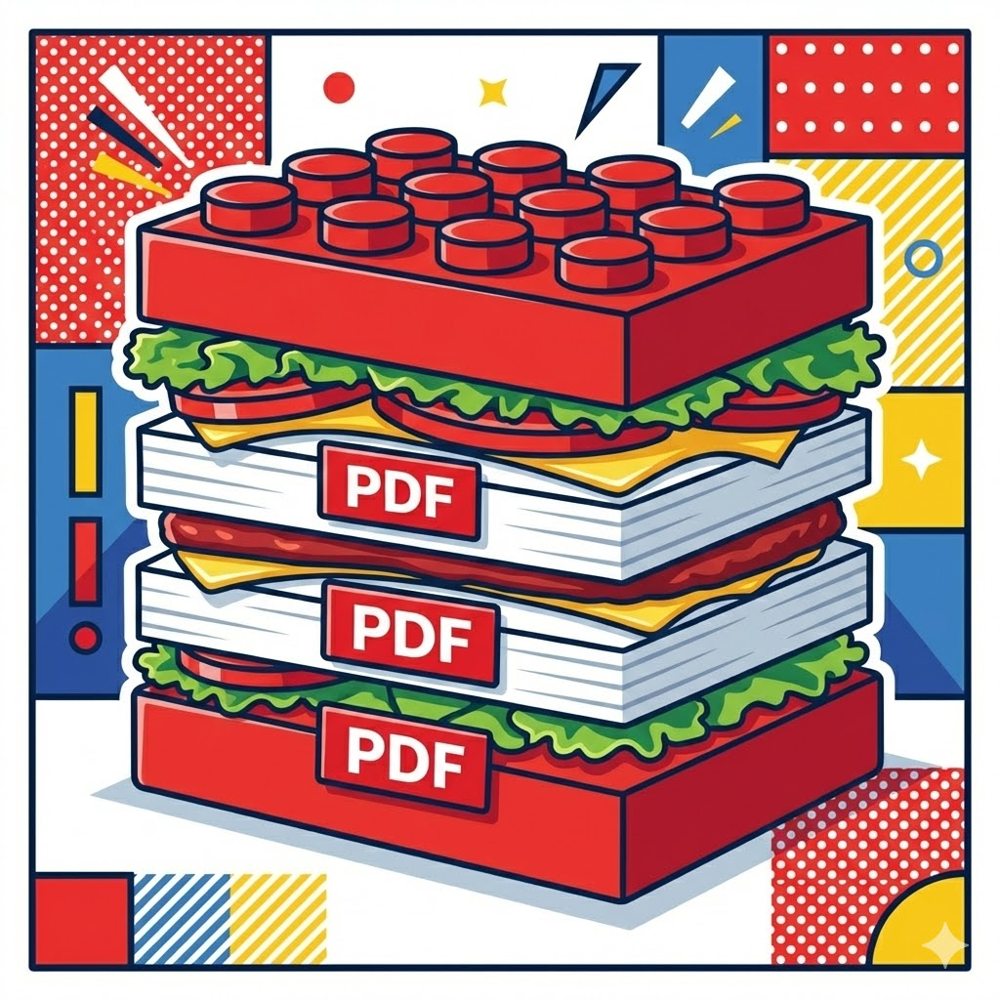

<p align="center">
  
</p>

<h1 align="center">pdf-burger</h1>

<p align="center">
  Stack multiple PDFs and directories into a single file.
</p>

<p align="center">
  <a href="#installation">Installation</a> •
  <a href="#usage">Usage</a> •
  <a href="#options">Options</a> •
  <a href="#examples">Examples</a>
</p>

---

## Installation

```bash
pip install pdf-burger
```

Or with [uv](https://docs.astral.sh/uv/):

```bash
uv tool install pdf-burger
```

## Usage

```bash
pdf-burger a.pdf b.pdf c.pdf
```

That's it. Output goes to `merged.pdf` by default.

## Options

| Option | Description |
|---|---|
| `-o`, `--output` | Output file path (default: `merged.pdf`) |
| `-r`, `--recursive` | Search directories recursively |
| `--overwrite` | Allow overwriting an existing output file |
| `--verbose` | Show detailed log |
| `--dry-run` | List target files without merging |
| `-V`, `--version` | Show version |

## Examples

```bash
# Merge specific files
pdf-burger a.pdf b.pdf c.pdf -o combined.pdf

# Merge all PDFs in a directory (natural sort: 1, 2, 10)
pdf-burger ./invoices/

# Search subdirectories recursively
pdf-burger ./docs/ -r

# Mix files and directories — input order is preserved
pdf-burger cover.pdf chapters/ appendix.pdf -o book.pdf

# Preview which files would be merged
pdf-burger ./docs/ --dry-run

# Overwrite an existing output
pdf-burger *.pdf -o report.pdf --overwrite
```

### Smart output naming

When `-o` is omitted:

- Multiple inputs → `merged.pdf`
- Single directory → `{directory_name}.pdf`
- Name collision → auto-numbered (`merged_001.pdf`, `merged_002.pdf`, ...)

### Directory handling

- PDFs within a directory are sorted in **natural order** (`1.pdf`, `2.pdf`, `10.pdf`)
- Non-recursive by default; use `-r` to include subdirectories
- Corrupt PDFs in directories are **skipped with a warning**

## License

MIT
